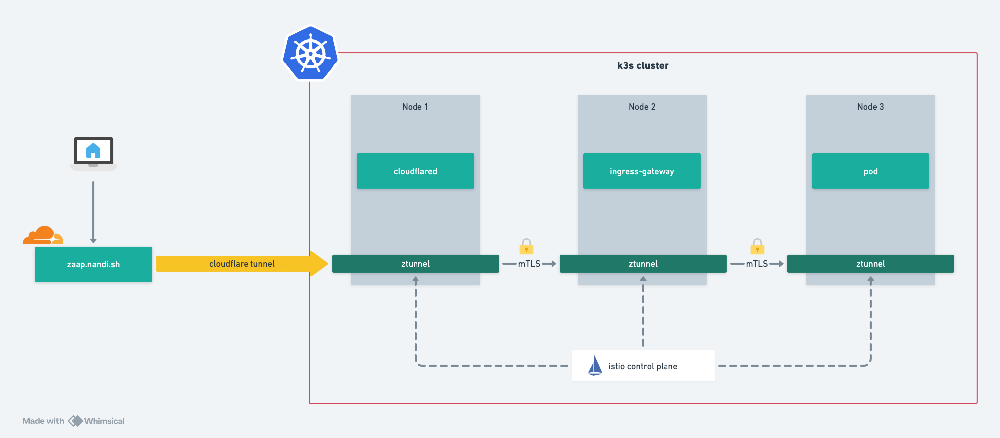

# Zaap


Zaap(雥) is a cloud-native setup for a home lab that provides a unified interface to manage various services and applications.
It is designed to be modular, allowing users to easily add or remove components as needed.
This is an opinionated setup, meaning it comes with a set of pre-configured services and applications that can be easily deployed and managed.

For my own home lab, the underlying Kubernetes setup is based on [zaap-k3s](https://github.com/nandiheath/zaap-k3s), 
which is a lightweight Kubernetes distribution designed for home labs and edge computing.

## Overview

### Stack

| Service           | Description                                                            |
|-------------------|------------------------------------------------------------------------|
| ArgoCD            | GitOps continuous delivery tool for Kubernetes                         |
| External-Secrets  | Kubernetes controller for managing secrets from external sources       |
| 1password-Connect | Connects Kubernetes to 1Password for secret management                 |
| Istio             | Service mesh providing traffic management, security, and observability |
| Cert-Manager      | Kubernetes add-on to automate the management of TLS certificates       |
| Cilium            | CNI for Kubernetes networking with advanced security features          |
| MetalLB           | Load balancer implementation for bare metal Kubernetes clusters        |
| Cloudflared       | Cloudflare Tunnel client for secure external access to the cluster     |
| Bootstrap         | Initial setup components for the cluster                               |
| Network-Configs   | Network configuration resources like Gateways and VirtualServices      |
| Prometheus        | Monitoring and alerting toolkit for Kubernetes                         |
| Grafana           | Visualization and analytics platform for monitoring data               |
| Loki [TODO]       | Log aggregation system for Kubernetes                                  |
| Longhorn [TODO]  | Distributed block storage for Kubernetes clusters                     |
| Immich [TODO]   | Self-hosted photo and video management system                          |

### Architecture

The Zaap stack uses several key components working together:

- **Networking**: Cilium provides CNI functionality with kubeProxyReplacement enabled, configured to work with Istio ambient mode.
- **Service Mesh**: Istio components (base, CNI, ingressgateway, ztunnel, istiod) manage internal and external traffic.
- **External Access**: Instead of using LoadBalancer services, the setup uses Cloudflare Tunnel (cloudflared) to securely expose services.
- **Certificate Management**: Cert-Manager handles TLS certificates for secure communications.
- **Secret Management**: External-Secrets with 1Password Connect allows secure management of secrets.
- **GitOps Deployment**: ArgoCD manages the deployment of all applications from Git repositories.




### Prerequisites & Important Notes

> ⚠️ **Critical Setup Requirements**
>
> Before proceeding with Zaap installation, ensure your environment meets these prerequisites:

#### Kubernetes Cluster
- **Base Cluster**: A functioning Kubernetes cluster is required
  - **Recommended**: [zaap-k3s](https://github.com/nandiheath/zaap-k3s) for optimal compatibility
  - This lightweight distribution is specifically designed for home labs and edge computing

#### Network Configuration
- **CNI Requirements**: 
  - Kubernetes cluster must be configured **without** kube-proxy and flannel
  - Cilium will be used as the CNI provider instead
  - [📚 K3s Configuration Guide](https://docs.cilium.io/en/v1.12/gettingstarted/k3s/#getting-started-using-k3s)

#### Service Mesh
- **Istio & Cilium Integration**: 
  - This setup uses Istio compatibility with Cilium in ambient mode
  - Proper configuration is essential for networking functionality
  - [📚 Integration Guide](https://docs.cilium.io/en/latest/network/servicemesh/istio/)

### Getting Started

1. Clone this repository:
   ```bash
   git clone https://github.com/nandiheath/zaap.git
   cd zaap
   ```

2. Create and configure the environment file:
   ```bash
   # Create .env file if it doesn't exist
   touch config/.env
   
   # Edit the .env file with required variables:
   # - ARGOCD_GITHUB_REPO: The repository URL for the Zaap project
   # - ARGOCD_GITHUB_ORG: The GitHub organization or user URL
   # - VAULT: The 1Password vault name used to store secrets
   ```

3. Generate the Kubernetes manifests:
   ```bash
   # Generate all manifests
   ./scripts/render.sh --all
   
   # Or generate manifests for a specific application
   ./scripts/render.sh --app <application-name>
   ```

4. Apply the generated manifests to your Kubernetes cluster using ArgoCD or kubectl.

You should also create corresponding environment variables on your Github repository to match the `.env` file.
This allows the CI steps to access the necessary secrets and configurations for generating the manifests and deploying them to your Kubernetes cluster.

## Requirements

- A Kubernetes cluster (recommended: [zaap-k3s](https://github.com/nandiheath/zaap-k3s))
- kubectl and kustomize installed
- yq installed for manifest processing
- 1Password account for secret management
- Cloudflare account for external access (if using cloudflared)