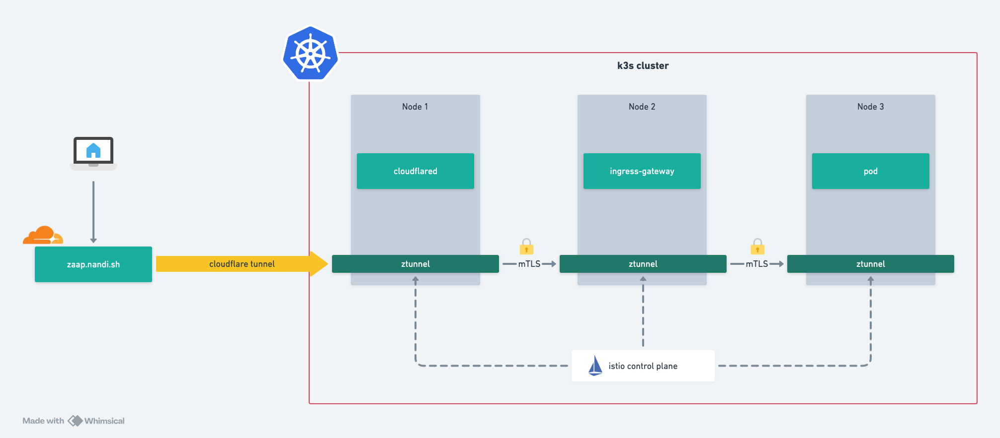

# Zaap


Zaap(雥) is a cloud-native setup for a home lab that provides a unified interface to manage various services and applications.
It is designed to be modular, allowing users to easily add or remove components as needed.
This is an opinionated setup, meaning it comes with a set of pre-configured services and applications that can be easily deployed and managed.

For my own home lab, the underlying Kubernetes setup is based on [zaap-k3s](https://github.com/nandiheath/zaap-k3s), 
which is a lightweight Kubernetes distribution designed for home labs and edge computing.

## Overview

### Stack

| Service           | Description                                                            |
|-------------------|------------------------------------------------------------------------|
| ArgoCD            | GitOps continuous delivery tool for Kubernetes                         |
| External-Secrets  | Kubernetes controller for managing secrets from external sources       |
| 1password-Connect | Connects Kubernetes to 1Password for secret management                 |
| Istio             | Service mesh providing traffic management, security, and observability |
| Cert-Manager      | Kubernetes add-on to automate the management of TLS certificates       |
| Cilium            | CNI for Kubernetes networking with advanced security features          |
| MetalLB           | Load balancer implementation for bare metal Kubernetes clusters        |
| Cloudflared       | Cloudflare Tunnel client for secure external access to the cluster     |
| Bootstrap         | Initial setup components for the cluster                               |
| Network-Configs   | Network configuration resources like Gateways and VirtualServices      |
| Prometheus        | Monitoring and alerting toolkit for Kubernetes                         |
| Grafana           | Visualization and analytics platform for monitoring data               |
| Loki [TODO]       | Log aggregation system for Kubernetes                                  |
| Longhorn [TODO]  | Distributed block storage for Kubernetes clusters                     |
| Immich [TODO]   | Self-hosted photo and video management system                          |

### Architecture

The Zaap stack uses several key components working together:

- **Networking**: Cilium provides CNI functionality with kubeProxyReplacement enabled, configured to work with Istio ambient mode.
- **Service Mesh**: Istio components (base, CNI, ingressgateway, ztunnel, istiod) manage internal and external traffic.
- **External Access**: Instead of using LoadBalancer services, the setup uses Cloudflare Tunnel (cloudflared) to securely expose services.
- **Certificate Management**: Cert-Manager handles TLS certificates for secure communications.
- **Secret Management**: External-Secrets with 1Password Connect allows secure management of secrets.
- **GitOps Deployment**: ArgoCD manages the deployment of all applications from Git repositories.




## Requirements

- A Kubernetes cluster without kube-proxy or flannel; [zaap-k3s](https://github.com/nandiheath/zaap-k3s) is the reference distribution.
- Cilium configured as the CNI and Istio configured for ambient mode.
- A 1Password account and Connect credentials for secret management.
- A Cloudflare account when the tunnel ingress is enabled.
- `kubectl` access is required only for bootstrap, recovery, and operator diagnostics.

Actionlint, Helm, Kustomize, ShellCheck, `yq`, and Kubeconform are pinned through Hermit and do not need system-wide installation.

## Setup and validation

1. Clone the repository and activate the toolchain:

   ```bash
   git clone https://github.com/nandiheath/zaap.git
   cd zaap
   source bin/activate-hermit
   ```

2. Configure `config/.env`. It may contain identifiers only:

   ```dotenv
   ARGOCD_GITHUB_REPO=https://github.com/nandiheath/zaap.git
   ARGOCD_GITHUB_ORG=https://github.com/nandiheath
   VAULT=example-vault-name
   ARGOCD_ADMIN_GITHUB_USER=operator@example.com
   ```

   Never add tokens, passwords, 1Password credentials, or cluster credentials to this file. GitHub Actions does not need these values as secrets because the tracked file supplies non-secret render inputs.

3. Render and validate the complete desired state:

   ```bash
   ./scripts/validate.sh
   git diff --exit-code -- artifacts/
   ```

4. Review the target `kubectl` context, then run the bootstrap script from a trusted operator workstation. Bootstrap installs the minimum resources required for Argo CD and External Secrets. Argo CD performs subsequent continuous delivery from `main`.

## Continuous delivery

Pull requests run a credentialless, read-only GitHub Actions workflow that renders all source manifests, validates known Kubernetes schemas, and fails when committed artifacts are stale. The workflow never calls `kubectl` or an Argo CD API.

Protect `main` with the `Validate desired state / Render and validate` status check, disallow force pushes, include administrators, and require reviewed pull requests. Argo CD is configured to pull reviewed `main` revisions and reconcile them with prune and self-heal enabled.

## Automated dependency updates

Install the [Renovate GitHub App](https://github.com/apps/renovate) for this repository to activate `renovate.json`. Renovate discovers Kustomize Helm charts, Kubernetes container images, GitHub Actions, MetalLB, and patch-level CloudNativePG releases. Updates wait at least seven days, cluster-critical updates wait fourteen days, images are digest-pinned, and automerge is disabled.

Because Argo CD consumes committed `artifacts/`, update branches must run `./scripts/validate.sh` and commit the regenerated artifact changes before merge. Major and persistent-data updates require the migration and recovery evidence declared by their task.